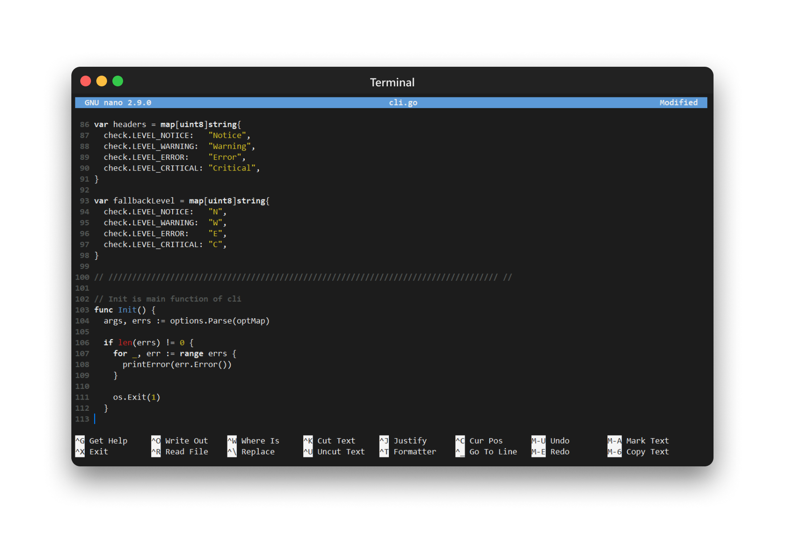
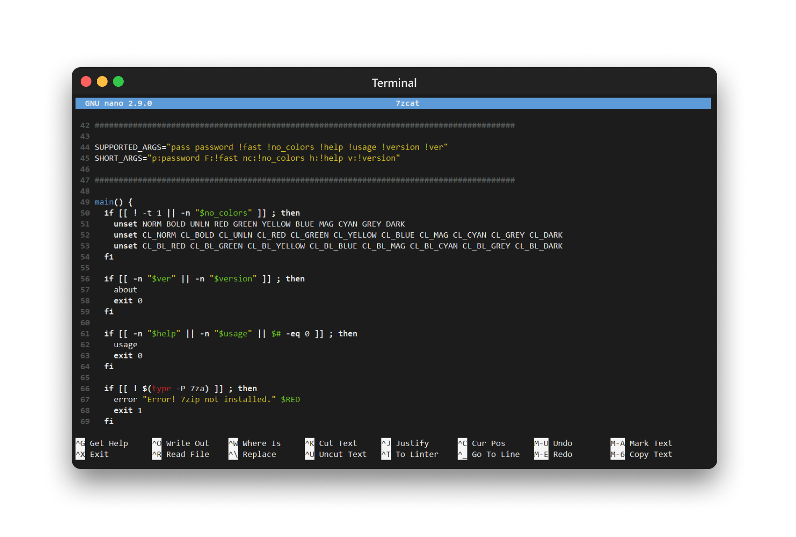

## 𝗕𝗟𝗔𝗖𝗞𝗛⬤𝗟𝗘 Theme for Nano

### Screenshots

### Install

1. Download or checkout this repository;
2. Copy nanorc files into `/usr/share/nano` directory;
3. Restart nano.

### License

[Apache License, Version 2.0](https://www.apache.org/licenses/LICENSE-2.0)

